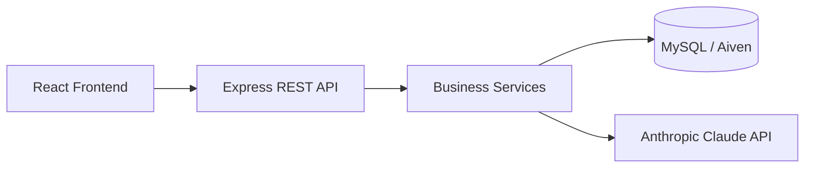
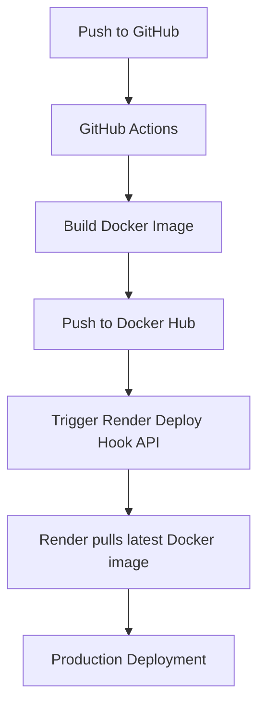

# Service Tracking Platform Backend

**Status:** Production-ready and deployed

## About The Project

The backend for the Service Tracking Platform is a production-ready REST API built with Node.js, Express.js, TypeScript, and MySQL using Sequelize ORM.

It manages the complete lifecycle of service requests, including AI-powered request classification, technician assignment, authentication, authorization, and real-time workflow management.

The API provides:

- JWT authentication
- Role-Based Access Control (RBAC)
- AI-powered service request classification
- AI-assisted technician recommendations
- Request lifecycle management
- Docker containerization
- Swagger/OpenAPI documentation

The backend is deployed on Render and connects securely to an Aiven MySQL database.

---

## Features

- JWT authentication
- Role-based authorization
- AI-powered request classification
- AI technician recommendations
- Status transition validation
- OpenStreetMap integration
- Swagger documentation
- Dockerized deployment
- Cloud-hosted MySQL database
- CI/CD with GitHub Actions

---

## Architecture



---

## Tech Stack

| Category | Technologies |
|----------|--------------|
| Backend | Node.js 22, Express.js 5, TypeScript |
| Database | MySQL, Sequelize ORM |
| AI | Anthropic Claude API |
| DevOps | Docker, Docker Compose, GitHub Actions, Render, Docker Hub |
| Documentation | Swagger / OpenAPI |
| Security | JWT, bcrypt |

---

## System Roles
 
| Role | Description |
|---|---|
| Customer | Creates and tracks service requests |
| Staff | Manages requests and assigns technicians |
| Technician | Views assigned jobs and updates status |

---

## AI Features

### AI Service Request Classification

Customers describe their issue in plain language. Claude analyzes the customer's natural language description and automatically:
 
- Detects the requested service
- Cleans and normalizes the description
- Detects urgency using tool use
- Assigns request priority (Low / Medium / High)

Example input:

```
"My internet connection stopped working and the router is blinking red."

```

Claude returns structured data that is saved directly to the database.

### AI Technician Recommendation

The platform can automatically recommend the best technician for a service request based on:

- Skill match with the service type
- Current workload (active job count)
- Availability status
- Maximum active jobs capacity


Claude receives a filtered list of available technicians and returns the most suitable technician together with the reasoning behind the recommendation.

---
 
## Authentication Flow
 
1. User registers via `POST /api/auth/register`
2. Password is hashed with bcrypt before storage
3. User logs in via `POST /api/auth/login`
4. Server returns a signed JWT token
5. Client sends token in the `Authorization: Bearer <token>` header
6. Middleware validates token and attaches user + role to the request
7. Frontend automatically logs the user out when the JWT expires

---

## Database Schema
 
Core tables:
 
| Table | Description |
|---|---|
| Users | All users with role reference |
| Roles | Customer, Staff, Technician |
| ServiceRequests | Customer requests with AI-classified data |
| Services | Service categories (Plumbing, Electrical, etc.) |
| JobAssignments | Technician assignments per request |
| StatusHistory | Full audit trail of status changes |
| Locations | Address data for requests and technicians |
| Statuses | Created, Assigned, InProgress, Completed, Cancelled |
| TechnicianProfiles | Skills, availability, workload capacity per technician |
 
All relationships are defined via Sequelize associations and follow 3NF.

---

## API Documentation
 
Interactive API documentation is available through Swagger.

Development

```
http://localhost:3000/doc
```

Production

```
https://service-tracking-backend-latest.onrender.com/doc/
```
 
### Auth
 
| Method | Endpoint | Description |
|---|---|---|
| POST | /api/auth/register | Register a new user |
| POST | /api/auth/login | Login and receive JWT token |
 
### Service Requests
 
| Method | Endpoint | Description |
|---|---|---|
| GET | /api/requests | Get all service requests |
| GET | /api/requests/:id | Get request by ID |
| POST | /api/requests | Create request (AI-powered) |
| POST | /api/requests/smart | Create request using AI — classifies service type, detects urgency, sets priority automatically
| PUT | /api/requests/:id | Update request |
| DELETE | /api/requests/:id | Delete request (Staff only) |
| PATCH | /api/requests/:id/status | Update request status |

### POST /api/requests
Creates a service request manually. Requires `serviceId` to be provided by the client.

### POST /api/requests/smart
Creates an AI-powered service request. Only requires a plain text `description` and `locationId`.
Claude automatically classifies the service type, cleans the description, detects urgency, and sets priority.

Sample request:
{
  "description": "The router is blinking red and internet is down",
  "locationId": 1
}
 
### Job Assignments
 
| Method | Endpoint | Description |
|---|---|---|
| GET | /api/assignments | Get all assignments |
| GET | /api/assignments/:id | Get assignment by ID |
| GET | /api/assignments/recommend/:serviceRequestId | AI technician recommendation |
| POST | /api/assignments | Create manual assignment |
| PUT | /api/assignments/:id | Update assignment (Staff only) |
| DELETE | /api/assignments/:id | Delete assignment (Staff only) |
 
### Technicians
 
| Method | Endpoint | Description |
|---|---|---|
| GET | /api/technicians/assigned-requests | Get assigned jobs (Technician only) |
| PATCH | /api/technicians/:id/status | Update job status (Technician only) |
| PATCH | /api/technicians/location | Update current location (Technician only) |
 
### Services and Locations
 
| Method | Endpoint | Description |
|---|---|---|
| GET | /api/services | Get all services |
| GET | /api/locations | Get all locations |
 
---

## Deployment

The production backend is deployed using Docker on Render and connects to an Aiven MySQL database.

| Component | Platform |
|-----------|----------|
| Backend | Render |
| Database | Aiven MySQL |
| Container Registry | Docker Hub |
| CI/CD | GitHub Actions |



---

## Continuous Integration

Every push to the main branch automatically:

- installs project dependencies
- builds the TypeScript application
- builds a Docker image
- pushes the image to Docker Hub
- triggers a Render deployment

---

## Local Development

### Requirements
 
- Node.js 22+
- MySQL 8
- Anthropic API 

### Steps

1. Clone the repository

```bash
git clone https://github.com/leta373/service-tracking-platform.git
cd service-tracking-platform/backend
```

2. Install dependencies

```bash
npm install
```

3. Create .env.local

Example:

```
ADMIN_USERNAME=root
ADMIN_PASSWORD=YOURPASSWORD
DATABASE_NAME=service_tracking_db
DIALECT=mysql
PORT=3000
DATABASE_HOST=localhost
JWT_SECRET=YOUR_SECRET
ANTHROPIC_API_KEY=YOUR_API_KEY
```

> [!WARNING]
> Replace all placeholder values with your actual credentials. Never commit .env.local to version control.


The API will be available at `http://localhost:3000`.

---

## Docker Setup

### Run with Docker Compose

```bash
docker compose up --build
```

| Service | URL |
|---|---|
| Backend API | http://localhost:3000 |
| MySQL | localhost:3307 |


### Create `.env.docker`

Example:

```
ADMIN_USERNAME=root
ADMIN_PASSWORD=YOURPASSWORD
DATABASE_NAME=service_tracking_db
DIALECT=mysql
PORT=3000
DATABASE_HOST=db
JWT_SECRET=YOUR_SECRET
ANTHROPIC_API_KEY=YOUR_API_KEY
```

> [!NOTE]
> `DATABASE_HOST=db` refers to the MySQL container name in Docker Compose, not localhost.

### Useful Docker Commands

```bash
# Start all services
docker compose up

# Rebuild and start
docker compose up --build

# Stop all servcies
docker compose down

# Stop and remove database volumes
docker compose down -v

# Build backend image only
docker build -t service-tracking-backend .

# Run backend container only
docker run -p 3000:3000 --env-file .env.docker service-tracking-backend
```

### Connect to MySQL inside Docker

```bash
docker exec -it backend-db-1 mysql -u root -p
```

```sql
SHOW DATABASES;
USE service_tracking_db;
SHOW TABLES;
SELECT * FROM ServiceRequests;
```

External connection settings:
 
```
Host: localhost
Port: 3307
Username: root
Password: yourpassword
```

---

## Docker Hub

Latest production:

https://hub.docker.com/repository/docker/leta373/service-tracking-backend

```bash
docker pull leta373/service-tracking-backend:latest
```

```bash
docker run \
-p 3000:3000 \
--env-file .env.docker \
leta373/service-tracking-backend:latest
```

---

## Seed Data
 
On startup, the application automatically seeds:
 
- Roles (Customer, Staff, Technician)
- Statuses (Created, Assigned, InProgress, Completed, Cancelled)
- Services (Plumbing, Electrical, IT Support, Cleaning, etc.)
- Locations (sample addresses)

To disable seeding, comment out the seed calls:
 
```typescript
// await seedRoles();
// await seedStatuses();
// await seedServices();
// await seedLocations();
```

---
 
## Security
 
- JWT authentication
- Role-based authorization
- Secure password hashing with bcrypt
- Automatic JWT expiration
- Automatic client logout
- Request validation
- Transactional database operations
- Controlled status transitions
